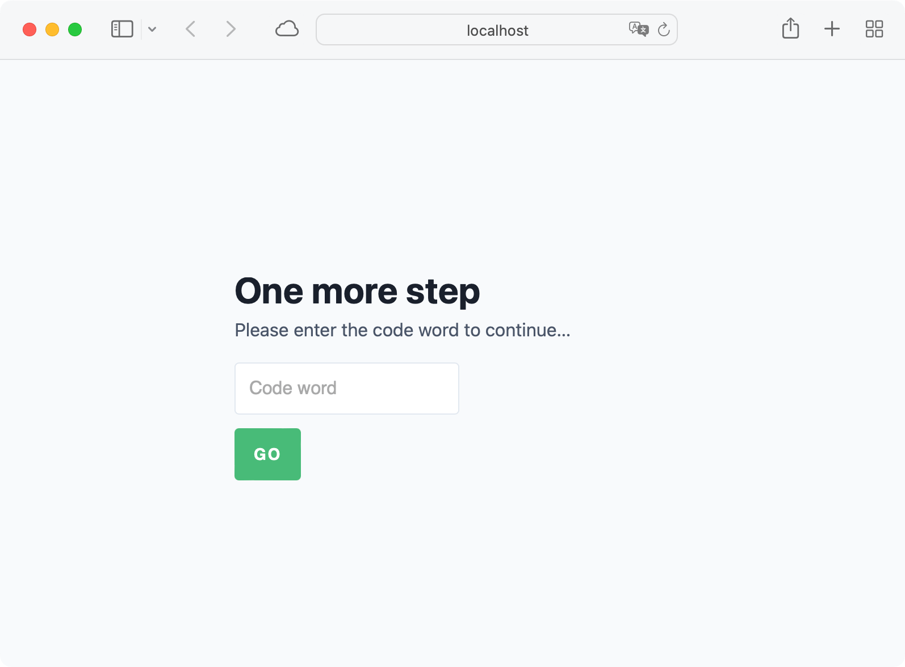

# Codeword

A simple gem to more elegantly place a staging server or other in-progress rails application behind a basic codeword. It’s easy to implement, share with clients/collaborators, and more beautiful than the typical password-protection sheet.



## Installation

1. Add this line to your application’s Gemfile:

```ruby
gem 'codeword'
```

2. Define a codeword (see Usage below).

3. Mount the engine in your application’s routes file (usually first, for best results):

```ruby
mount Codeword::Engine, at: '/codeword'
```

## Usage

To set a codeword, define CODEWORD in your environments/your_environment.rb file like so:

```ruby
ENV['CODEWORD'] = 'secret'
```

If you think you might need a hint:

```ruby
ENV['CODEWORD_HINT'] = 'Something that you do not tell everyone.'
```

If you’re using Rails >= 4.1 or Rails >= 5.2, you can add your Codeword Codeword via Rails Secrets or Rails Credentials functionality in your `secrets.yml` or `credentials.yml.enc` file, respectively:

```yml
codeword: 'love'
codeword_hint: 'Pepé Le Pew'
```

Alternately, Rails Credentials in >= 5.2 may be organized under the `codeword` namespace:

```yml
codeword:
  codeword: 'love'
  hint: 'Pepé Le Pew'
```

If you’re using [Figaro](https://github.com/laserlemon/figaro), set your Codeword codeword and hint (optional) in your application.yml file:

```yml
codeword: 'love'
codeword_hint: 'Pepé Le Pew'
```

**Codewords are not case-sensitive, by design. Keep it simple.**

## Advanced Usage

### Use Codeword around a specific controller:

1. Follow the installation instructions above.

2. In your application_controller.rb file, add:

```ruby
skip_before_action :check_for_codeword, raise: false
```

4. In the controller(s) you would like to restrict:

```ruby
before_action :check_for_codeword
```

### Link it with no typing:

    http://somedomain.com/or_path/?codeword=love

The visitor is redirected and the cookie is set without them ever seeing the Codeword splash page.

(Codeword also makes a rudimentary attempt based on user agent to **block major search engine bots/crawlers** from following this link and indexing the site, just in case it ever gets out into the wild.)

### Set a custom lifetime for cookie

The cookie set by Codeword defaults to 5 years. If you want to set a shorter amount of time, you can specify a number of weeks:

```ruby
ENV['COOKIE_LIFETIME_IN_WEEKS'] = 4

cookie_lifetime_in_weeks: 4
```

### Design Customization

If you would like to change the content or design of the codeword page, you can create the directories `app/views/layouts/codeword` and `app/views/codeword/codeword` and populate them with the default content from [here](https://github.com/dankimio/codeword/tree/main/app/views), and then customize as desired.

## Development

To install this gem onto your local machine, run `bundle exec rake install`. To release a new version, update the version number in `version.rb`, and then run `bundle exec rake release`, which will create a git tag for the version, push git commits and the created tag, and push the `.gem` file to [rubygems.org](https://rubygems.org).

## Acknowledgements

Codeword is a fork of [lockup](https://github.com/interdiscipline/lockup).
